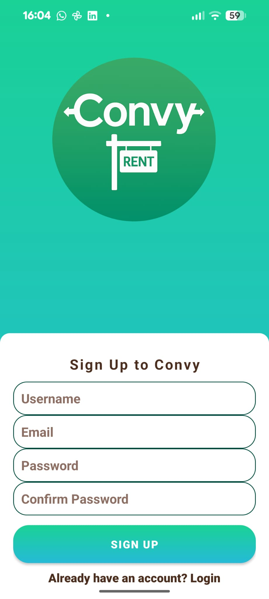
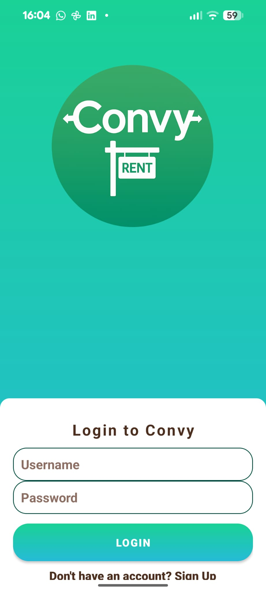
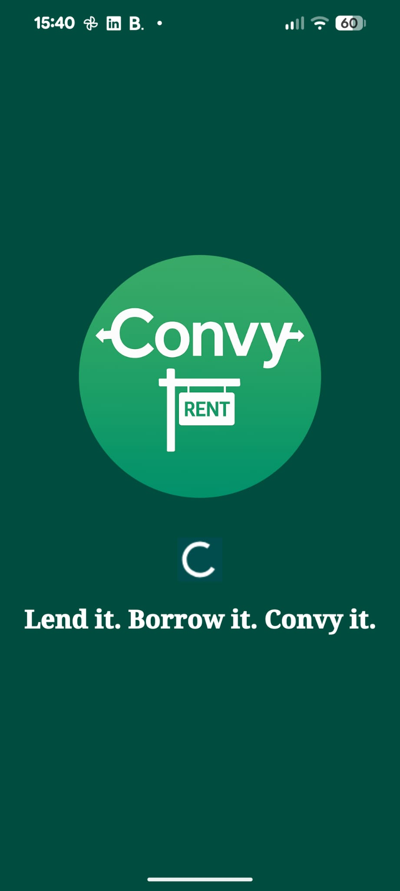
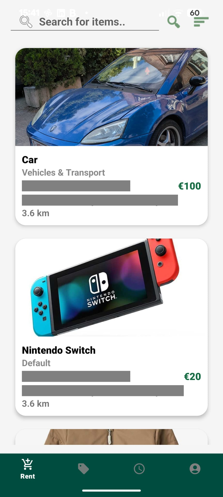
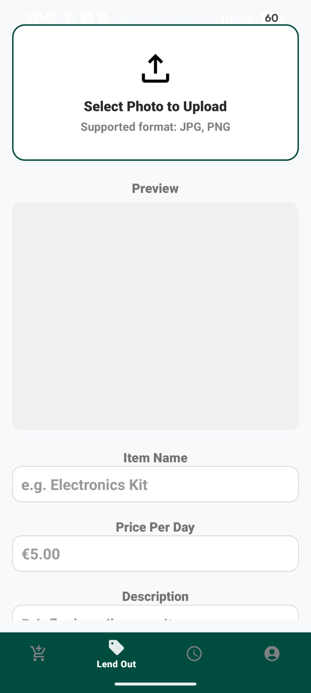
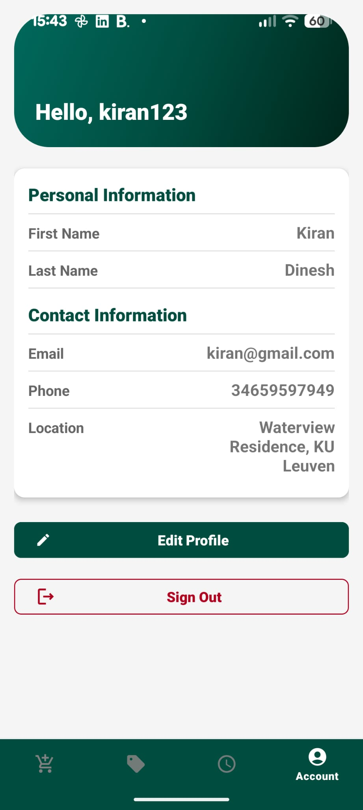
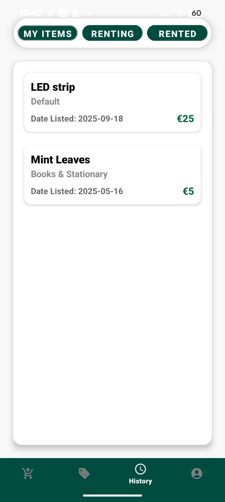
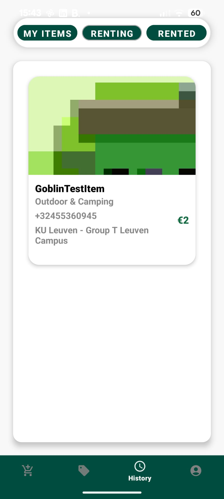
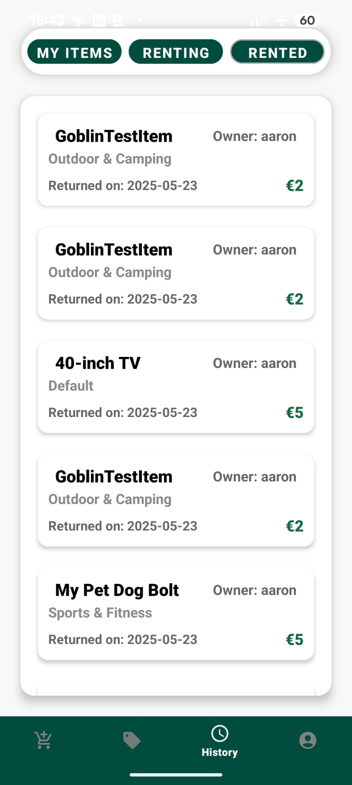

# 📱 Convy — Android Lending & Renting App

An Android application built for the Programming Techniques course at KU Leuven.  
**Convy** allows users to lend, browse, and rent items from others via an intuitive, category-based mobile platform. 
It features real-time item listings, detailed offer/rental history, and a smooth user experience using fragments and RecyclerViews.

---

## 🚀 Features

- **User Authentication**  
  Secure login and registration with input validation and error handling.

- **Lending Interface**  
  Add items to lend with categories, titles, descriptions, prices, and availability.

- **Renting System**  
  Browse available items, filter by category, and view detailed offer pages.

- **Rental History**  
  Tracks both items (rented from others) and (lent to others) in organized fragments.

- **Profile Management**  
  Edit account info, switch between tabs, and manage personal data.

- **Clean Navigation**  
  Bottom navigation with fragment swapping — no full reloads, no jank.

- **Backend Communication**  
  All data operations (CRUD) handled via **Volley** HTTP requests to a backend server.

---

## 🧱 Tech Stack

| Layer        | Technology                  |
|--------------|-----------------------------|
| Language     | Java                        |
| UI           | Android XML, Fragments      |
| Networking   | Volley HTTP Library         |
| Architecture | MVVM-lite (Fragment-based)  |
| IDE          | Android Studio              |
| Compatibility| API 28+                     |

## 📸  Screenshots of the App:

<table>
  <tr>
    <td><strong>Sign Up Page</strong></td>
    <td><strong>Login Page</strong></td
    <td><strong>Loading Screen</strong></td>
  </tr>
  <tr>
    <td></td>
    <td></td>
    <td></td>
  </tr>
  <tr>
    <td><strong>Renting Page</strong></td>
    <td><strong>Lending Page</strong></td>
    <td><strong>Account Page</strong></td>
  </tr>
  <tr>
    <td></td>
    <td></td>
    <td></td>
  </tr>
  <tr>
    <td><strong>My Items Fragment</strong></td>
    <td><strong>Renting Fragment</strong></td>
    <td><strong>Rented Fragment</strong></td>
  </tr>
  <tr>
    <td></td>
    <td></td>
    <td></td>
  </tr>
</table>

